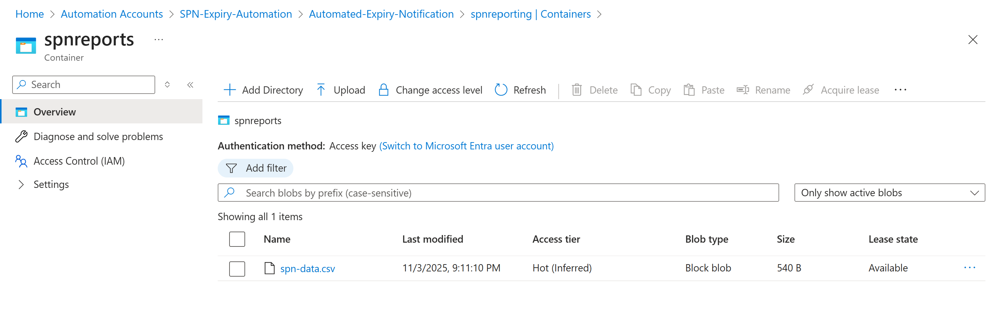

# Azure SPN Credential Expiry Notification


This project provides an automated PowerShell runbook for Azure Automation. It scans all Service Principals (SPNs) in your Microsoft Entra ID tenant, identifies credentials (secrets and certificates) that are nearing expiration, generates a full CSV report, and proactively sends HTML email notifications to the application owners via SendGrid.

This solution helps prevent application downtime and security incidents caused by expired credentials.

## Features

* **Proactive Alerts:** Sends notifications for credentials expiring on a configurable schedule (e.g., 90, 60, 30, 7 days out).
* **Secure by Design:**
    * Runs using an **Azure Automation Managed Identity**, eliminating the need for stored credentials in the script.
    * Securely retrieves the **SendGrid API Key** from encrypted Azure Automation variables.
* **Owner-Centric:** Automatically queries the Microsoft Graph API to find the owners of each application and sends the alert directly to them.
* **Audit Reporting:** Generates a complete CSV inventory of all SPNs and their credentials, which is then uploaded to Azure Blob Storage for auditing and historical tracking.
* **Rich Notifications:** Sends professionally formatted HTML emails with clear, actionable details.

## How it Works (Workflow)

1.  **Authentication:** The script starts by authenticating to Azure (`Connect-AzAccount`) and Microsoft Graph (`Connect-MgGraph`) using the Automation Account's Managed Identity.
2.  **Configuration:** It retrieves the `SendGridApiKey` from secure Automation Variables and gets a context for the specified Azure Storage Account.
3.  **Cleanup:** It performs cleanup by deleting any old reports from the local temp folder and the Azure Blob container to ensure a fresh run.
4.  **Data Fetching:** It queries the MS Graph API to get a list of *all* applications. It then iterates through each one to fetch:
    * Full credential details (both `KeyCredentials` and `PasswordCredentials`).
    * A list of `owners` for the application.
    * Owner names and email addresses.
5.  **CSV Report Generation:** All gathered data is compiled into a `PSCustomObject` array and exported to a CSV file.
6.  **Blob Upload:** This complete CSV report is uploaded to the configured Azure Blob Storage container, serving as a full inventory snapshot.
7.  **Alerting Logic:** The script downloads the same CSV from the blob, iterates through each credential, and calculates the number of days until expiry.
8.  **Email Notification:** If the `daysLeft` matches a value in the `$alertDays` array, the script:
    * Generates a custom HTML email for that specific credential.
    * Sends the email to the application's owners using the SendGrid API.
9.  **Disconnect:** The script cleans up by disconnecting the `AzAccount` and `MgGraph` sessions.

## Prerequisites

Before deploying this script, you must have the following resources and permissions set up in Azure.

### 1. Azure Resources

* **Azure Automation Account:** This is where the script will run as a Runbook.
* **Managed Identity:** A **System-Assigned** or **User-Assigned Managed Identity** must be enabled on your Automation Account.
* **Azure Storage Account:** A storage account with a **Blob Container** (e.g., `spnreports`) created. This is used to store the CSV reports.
* **SendGrid Account:** A SendGrid account and a valid **API Key** for sending emails.

### 2. Required PowerShell Modules

The following PowerShell modules must be imported into your Azure Automation Account:
* `Az.Accounts`
* `Az.Storage`
* `Az.Automation`
* `Microsoft.Graph.Authentication`
* `Microsoft.Graph.Applications` (or `Microsoft.Graph` as a whole)

### 3. Managed Identity Permissions

Your Automation Account's Managed Identity needs the following permissions.

**Microsoft Graph API Permissions:**
* `Application.Read.All`: To read all application properties and credentials.
* `User.Read.All` (or `Directory.Read.All`): To read the `mail` and `displayName` properties of the application owners.

**Azure RBAC Permissions:**
* **Storage Account:**
    * `Storage Account Key Operator`: To run `Get-AzStorageAccountKey`.
    * `Storage Blob Data Contributor`: To read, write, and delete blobs in the container.
* **Automation Account:**
    * `Automation Job Operator` (or similar): To execute the runbook.
    * A role with permission to read Automation Variables (e.g., `Automation Contributor` or a custom role with `Microsoft.Automation/automationAccounts/variables/read` action).

## Configuration

You need to configure variables in two places:

### 1. In-Script Variables

Update these variables at the top of the script to match your environment:

```powershell
# --- Configuration ---
$storageAccountName = "spnreporting"  # Your storage account name
$resourceGroupName = "Automated-Expiry-Notification" # RG of the storage account
$containerName = "spnreports"      # Your blob container name
$blobName = "spn-data.csv"
$tempCsvPath = "$env:TEMP\$blobName"
$date = Get-Date
$alertDays = @(1,2,3,4,5,6,7,15,30,89) # Customize your alert days

$FromEmail = "sasafiyullah@outlook.com" # Sender email (must be verified in SendGrid)
$FromName = "SPN-Notification"
```

### 2. Azure Automation Variables

You *must* create the following variable in your Automation Account's "Variables" blade:

* **Name:** `SendGridApiKey`
* **Type:** `String`
* **Value:** Your SendGrid API key (paste the full `SG.` key).
* **Encrypted:** **Yes** (This is crucial for security).

## Deployment

1.  **Create Runbook:** In your Azure Automation Account, create a new **PowerShell 7.x** Runbook.
2.  **Copy Script:** Paste the entire PowerShell script into the runbook's editor.
3.  **Save and Publish:** Save and then **Publish** the runbook.
4.  **Schedule:** Go to the "Schedules" blade of your runbook and link a new or existing schedule (e.g., "Run Daily at 9 AM").

The script is now fully automated and will run on the schedule you defined.

## Container where CSV save Example

When the script runs and export all the SPN a credential nearing expiry, it store the CSV in a specific container.

**Here is an example of the container:**



## Customization

* **Alert Days:** To change when notifications are sent, modify the `$alertDays` array. For example, for quarterly and monthly alerts, you could use:
    `$alertDays = @(1, 7, 30, 90)`
* **Email HTML:** The HTML and CSS for the email are defined in the `$HtmlHead` variable and the `Get-HtmlTable` function. You can modify these to match your company's branding.
* **Owner Email Logic:** The script contains custom logic to parse emails (`if ($email -match "_")`). This can be modified or removed if your organization's email formats are different.

## 📧 Output Example

When the script detects a credential nearing expiry, it sends a clear, HTML-formatted email alert to the application owners.

**Here is an example of the notification email:**


